<div align="center">

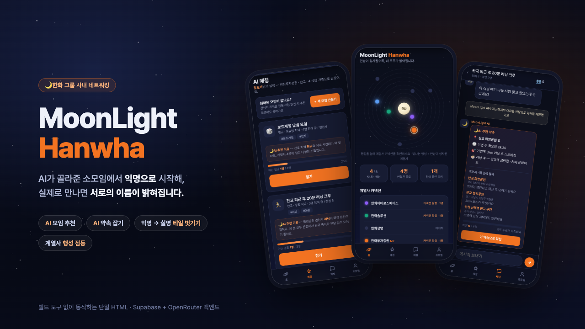

### 회사에는 이미 사람이 많다. 서로를 발견할 기회가 없었을 뿐이다.

**MoonLight Hanwha**는 한화 그룹사 구성원을 위한 사내 네트워킹 모바일 웹앱입니다.<br>
AI가 만남을 지정하는 대신 **만나고 싶은 이유**를 찾아주고, 익명 대화로 시작한 관계가<br>
실제 만남으로 이어지면 그제야 서로의 이름이 밝혀집니다.

[**라이브 데모 열기 →**](https://junyeong-nero.github.io/hanwha-ai-solution/src/) · [기능 명세](docs/features.md) · [문제 정의](docs/background.md) · [배포 가이드](docs/deployment.md)

</div>

---

## 무엇을 푸는 서비스인가

동료 관계는 친목의 문제가 아니라 **조직에 남아 있게 하는 요소**입니다. 직장인 470명 조사에서 85.3%가 사내 인간관계 관리가 필요하다고 답했고, 66.4%는 업무 스트레스보다 인간관계 때문에 퇴사를 더 많이 고민한다고 했습니다. 중소기업 근로자 1,769명을 분석한 2025년 연구에서도 일터우정이 높을수록 이직의도가 유의하게 낮아졌습니다.

그런데 관계는 잘 만들어지지 않습니다. 같은 조사에서 58.6%가 회사에서 "일부 사람들하고만 친하게 지낸다"고 답했습니다. 그렇다고 회사가 "A님과 B님, 이번 주에 만나세요"라고 지정하면 부담이 됩니다 — 인간관계 관리가 불필요하다고 답한 사람의 52.4%가 그 이유로 '불필요한 감정 소모'를 들었습니다.

> **문제는 사람이 없는 것이 아니라, 서로를 알 접점과 자발적으로 만날 이유가 없다는 것입니다.**

MoonLight Hanwha는 세 가지 방식으로 이 지점을 건드립니다.

| | |
| --- | --- |
| 🌙 **만남이 아니라 이유를 추천한다** | AI가 프로필을 읽고 "왜 이 사람들이 만나면 좋은지"를 문장으로 붙여 모임을 제안합니다. 공통 키워드가 아니라 업무·취향·생활권·성장의 접점을 봅니다. |
| 🎭 **익명으로 시작한다** | 채팅은 닉네임으로 시작합니다. 잘 맞지 않으면 그냥 나가면 되므로, 관계를 시작하는 비용이 낮습니다. |
| ✨ **만나야 이름이 밝혀진다** | 실제로 만나 서로 '만남 완료'를 누르면 그때 실명이 공개되고, 홈 화면의 계열사 행성이 하나씩 켜집니다. 만날수록 내 우주가 밝아지는 보상 루프입니다. |

---

## 이렇게 동작합니다

<table>
<tr>
<td width="33%" valign="top">

**① AI가 모임을 고른다**

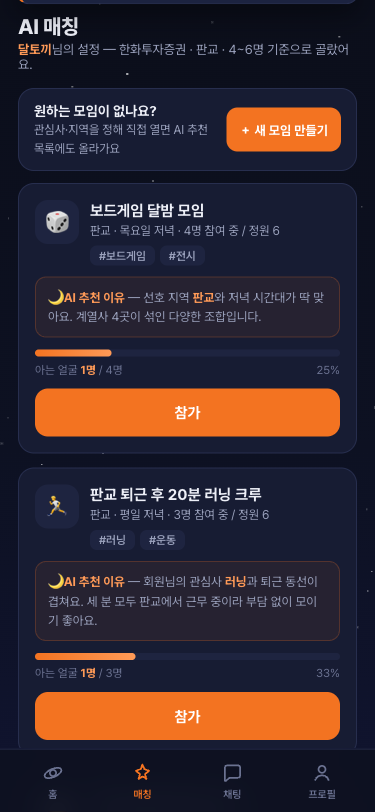

프로필의 계열사·지역·나이·관심사·취미·모임 규모를 근거로 모임을 추천하고, **추천 이유**를 함께 보여줍니다. 카드의 주황 띠는 그 모임에 **이미 만난 적 있는 사람이 몇 %인지**를 나타냅니다 — 띠가 길면 편한 자리, 짧으면 완전히 새로운 만남입니다.

</td>
<td width="33%" valign="top">

**② 익명으로 대화한다**

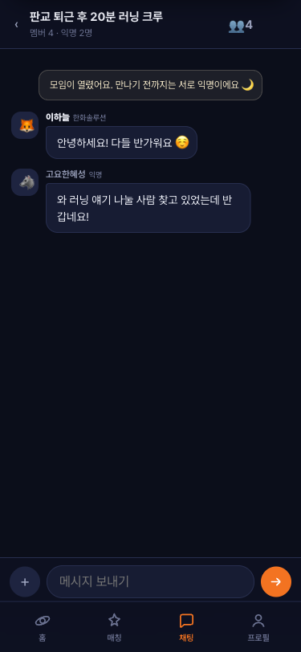

참가하면 그 모임의 채팅방이 열립니다. 모두 닉네임으로 대화하지만, **내가 이미 만난 적 있는 사람만 실명으로 보입니다.** 그래서 같은 방 안에 익명과 실명이 섞여 있습니다.

</td>
<td width="33%" valign="top">

**③ AI가 약속을 잡는다**

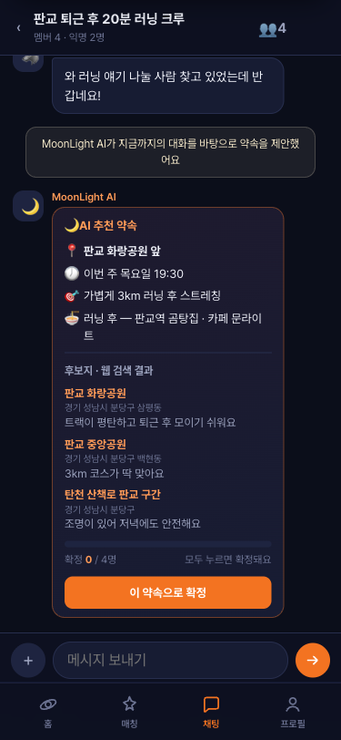

`＋` → **AI 추천 약속 잡기**를 누르면 AI가 모임 지역·관심사로 **실제 장소를 검색**한 뒤, 그동안의 대화에 맞춰 장소·시간·활동·맛집을 한 장의 카드로 제안합니다.

</td>
</tr>
<tr>
<td width="33%" valign="top">

**④ 전원이 동의해야 확정된다**

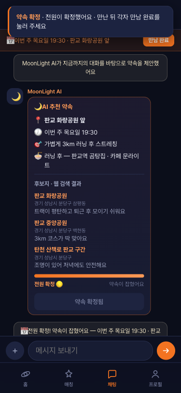

확정은 **전원 투표**입니다. 한 명이 눌렀다고 잡히지 않고, 방 인원이 모두 눌러야 약속이 성사됩니다. 지도 앱을 열 필요 없이 약속의 전 과정이 앱 안에서 끝납니다.

</td>
<td width="33%" valign="top">

**⑤ 만나면 이름이 밝혀진다**

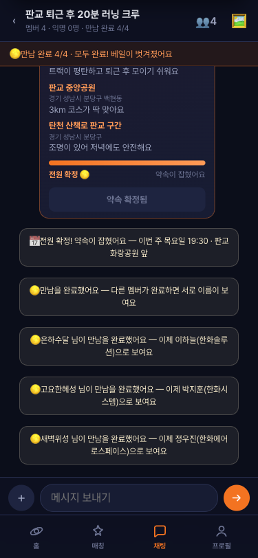

만난 뒤 각자 **만남 완료**를 누릅니다. 나와 상대가 **둘 다** 눌렀을 때만 그 사람의 이름과 계열사가 보입니다. 아직 안 누른 사람은 계속 익명이라 **사람마다 보이는 이름이 다릅니다.** 동시에 모임 사진첩이 열립니다.

</td>
<td width="33%" valign="top">

**⑥ 내 우주가 밝아진다**

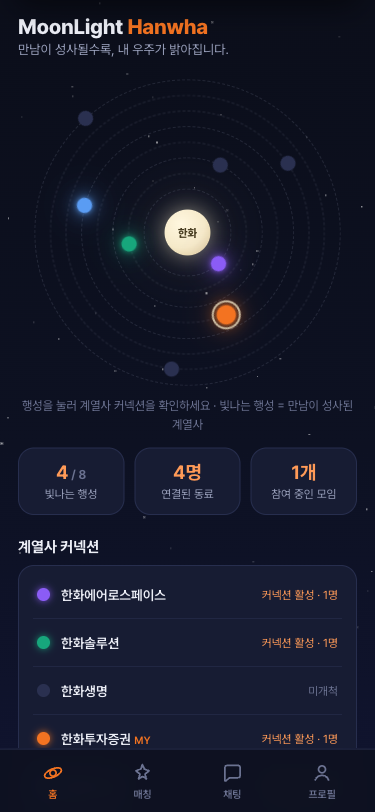

만남이 성사된 계열사의 행성이 홈 화면에서 **밝게 켜집니다.** 어디까지 닿았고 어디가 미개척인지 한눈에 보이며, 이것이 다음 만남을 만드는 동기가 됩니다.

</td>
</tr>
</table>

---

## 화면

<table>
<tr>
<td width="25%" align="center">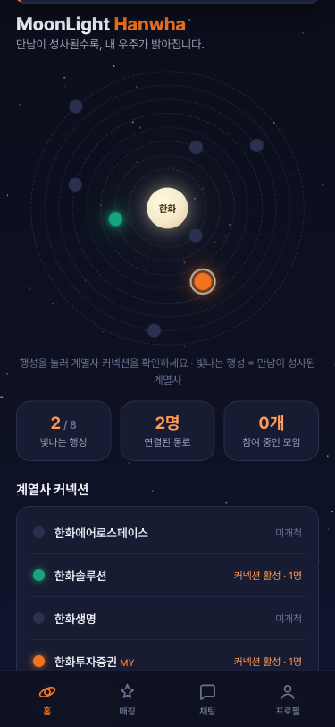<br><b>홈</b><br><sub>계열사는 행성, 만남은 점등</sub></td>
<td width="25%" align="center">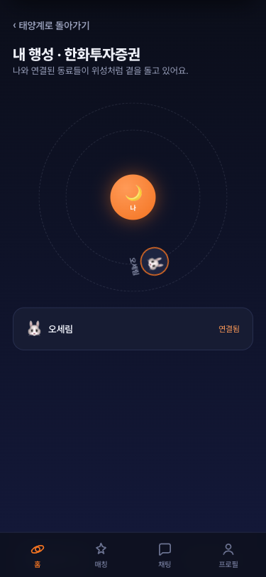<br><b>내 행성</b><br><sub>연결된 동료가 위성이 된다</sub></td>
<td width="25%" align="center">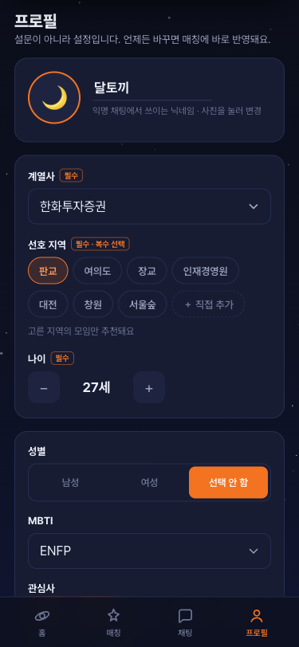<br><b>프로필</b><br><sub>설문이 아니라 설정</sub></td>
<td width="25%" align="center">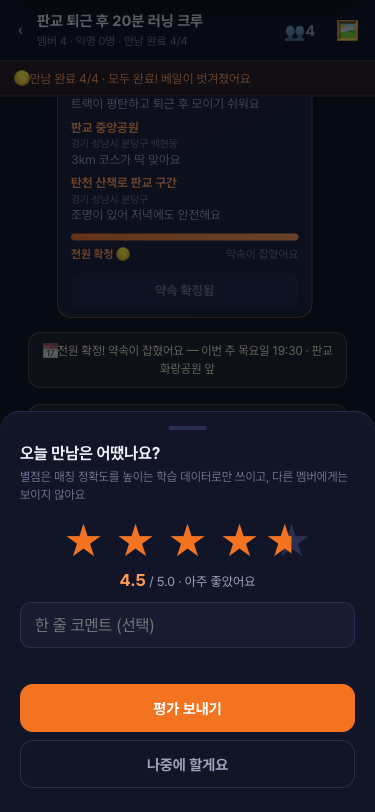<br><b>만남 평가</b><br><sub>별점은 매칭 학습에만 쓰인다</sub></td>
</tr>
</table>

- **홈** — 그룹사 전체를 태양계로 그립니다. 만남이 성사된 계열사만 빛나고, 내 행성으로 들어가면 연결된 동료가 위성처럼 공전합니다.
- **프로필** — 설문이 아니라 **설정**입니다. 계열사·선호 지역·나이가 필수, 성별·MBTI·관심사·취미·모임 규모가 선택입니다. 같은 성별 우선 / 계열사 범위 / **깊은 유대 vs 넓은 인맥** 성향을 바꾸면 매칭 순서가 즉시 달라집니다.
- **만남 평가** — 만남 후 별 0.5~5점을 남깁니다. 다른 멤버에게는 보이지 않고, 저장 시 그 시점의 특성 스냅샷(모임 지역·태그·인원, 내 관심사·성향, 아는 사람 수 등)과 함께 **"특성 → 만족도" 학습 예시**로 쌓입니다. 실명과 사번은 포함되지 않습니다.

---

## AI가 하는 일

| 기능 | 입력 | 하는 일 |
| --- | --- | --- |
| **모임 추천** | 프로필 설정값, 참여 가능한 모임 목록, 만남 이력 | 선호 지역 안의 모임을 고르고, 왜 맞는지를 한 문장으로 붙여 정렬합니다 |
| **약속 제안** | 최근 대화(익명 처리), 모임 지역·관심사 | 카카오 로컬로 실제 장소를 검색해 후보지를 만들고, 그 안에서 장소·시간·활동·맛집을 고릅니다 |
| **매칭 학습 데이터** | 만남 평가 별점 + 특성 스냅샷 | 추천 정확도를 높이기 위한 학습 예시를 축적합니다 (학습 자체는 다음 단계) |

외부 LLM에 보내는 대화는 **익명 처리 후 전송**되며, 실명·사번은 포함되지 않습니다. LLM 호출은 브라우저가 아니라 **Supabase Edge Function**에서만 일어나므로 API 키가 클라이언트에 노출되지 않습니다. LLM 응답이 실패하면 규칙 기반 추천으로 자동 폴백합니다.

---

## 어떻게 만들었나

**`src/index.html` 파일 하나**입니다. HTML·CSS·JavaScript가 모두 들어 있고 빌드 도구가 없습니다. 파일 상단 `CONFIG` 값에 따라 두 가지 모드로 동작합니다.

| | 로컬 데모 모드 | 백엔드 모드 |
| --- | --- | --- |
| **조건** | `CONFIG`가 비어 있을 때 (기본) | `CONFIG`에 Supabase URL·anon 키를 채웠을 때 |
| **네트워크** | 요청 없음 | Supabase Auth·DB·Realtime, Edge Function → OpenRouter |
| **데이터** | 하드코딩 상수 + 전역 `S` 객체, 새로고침하면 초기화 | 사번 기반 로그인으로 어느 기기에서든 프로필·채팅 복원 |
| **쓰임** | 브라우저에서 파일만 열면 되는 오프라인 시연 | 실제 다인 시연 (실시간 채팅, LLM 추천) |

두 모드는 서버 데이터를 같은 상수 모양으로 채워 넣어 **렌더링 코드를 공유**합니다. 브라우저에는 anon 키만 들어가며, 시크릿 키가 HTML에 섞이면 테스트가 실패합니다.

모바일 우선으로 만들어 iOS Safari 대응(`100dvh`, `env(safe-area-inset-*)`, 16px 이상 입력 폰트, 44px 터치 타겟, `prefers-reduced-motion`)을 지켰습니다.

---

## 시작하기

### 로컬에서 바로 보기 — 설치 없음

```bash
git clone https://github.com/junyeong-nero/hanwha-ai-solution.git
open hanwha-ai-solution/src/index.html
```

`CONFIG`를 비우면 네트워크 없이 로컬 데모 모드로 동작합니다. 휴대폰 화면 기준으로 설계되었으니 개발자 도구에서 **375×812 뷰포트**로 보는 것을 권장합니다.

### 라이브 데모

[junyeong-nero.github.io/hanwha-ai-solution/src/](https://junyeong-nero.github.io/hanwha-ai-solution/src/) — 백엔드 모드로 배포되어 있어 **입장 코드와 계열사·사번·이름**이 필요합니다. 코드 없이 둘러보려면 위의 로컬 실행을 사용하세요.

### 테스트

```bash
node --test tests/*.mjs   # Node 24 필요 (Edge Function의 .ts 모듈을 그대로 읽습니다)
```

---

## 문서

| 문서 | 내용 |
| --- | --- |
| [features.md](docs/features.md) | 4개 탭과 전체 사용자 흐름의 기준 문서 (SSOT) |
| [background.md](docs/background.md) | 사내 네트워킹 문제 정의와 데이터 근거 |
| [deployment.md](docs/deployment.md) | Supabase·Edge Function·Pages 배포 절차 |
| [submission.md](docs/submission.md) | 한화 AI 솔루션 챌린지 제출 진행 상황판 |
| [overview.md](docs/overview.md) | 피벗 이전 초기 기획 (참고용) |

## 프로젝트 구조

```text
├── src/index.html          # 프로토타입 본체 (단일 파일 · 이중 모드)
├── supabase/
│   ├── migrations/         # 스키마 · RLS · RPC
│   ├── functions/          # Edge Functions (Deno) — LLM 호출은 여기에서만
│   └── seed.sql
├── docs/
│   ├── features.md · background.md · deployment.md · submission.md
│   ├── screenshots/        # README 이미지와 대표 이미지 생성기
│   └── superpowers/        # 백엔드 설계 · 실행 계획
├── tests/                  # node --test tests/*.mjs
└── assets/fonts/           # Pretendard
```

<div align="center"><br>
<sub>한화 AI 솔루션 챌린지 · 사내 네트워킹 프로토타입</sub>
</div>
