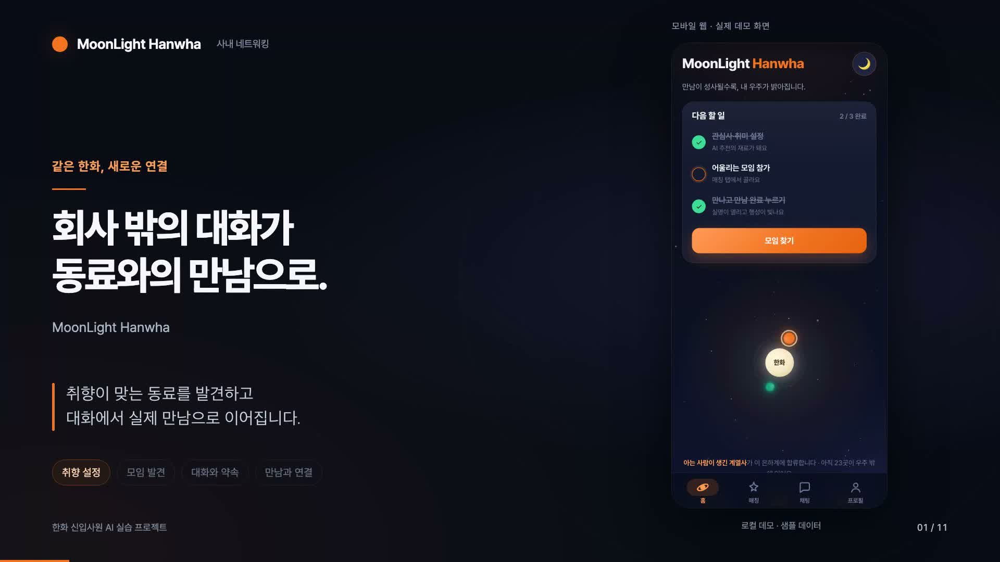

# MoonLight Hanwha 소개 영상

**1분 54초의 자막 중심 웹 시연 영상**입니다. TTS 없이 큰 핵심 문구와 22개의 짧은 설명 자막으로 기능을 안내하며, 직접 합성한 잔잔한 배경음과 장면 전환음만 사용합니다.

- [영상 MP4](MoonLight_Hanwha_데모_소개_자막판.mp4)
- [브라우저 미리보기](미리보기.html)
- [설명 자막 SRT](MoonLight_Hanwha_자막.srt)
- [화면 대본·시간표](대본.md)



## 구성과 범위

프로필 설정 → 모임 추천 → 참가·익명 채팅 → AI 약속 제안 → 후보 장소 변경 → 전원 확정 → 만남 완료·실명 공개 → 평가·사진첩 → 홈 연결 변화.

375×812 모바일 뷰포트에서 실제 앱 버튼을 조작해 녹화했습니다. `?demo=1`의 로컬 샘플 데이터를 사용하며, 다른 멤버의 답장·투표·만남 완료는 앱이 제공하는 데모 시뮬레이션입니다. 만남 완료 장면은 실제 만남 이후를 가정하며 영상에도 표시했습니다. 사진첩은 예시 화면입니다.

최종 영상은 114.402초, 1920×1080, 30fps, H.264 + AAC, 약 9.5MiB입니다. 설명 자막은 영상에 직접 포함되어 별도로 켤 필요가 없습니다.

## 자막 재편집

`source/finish_captions.py`의 `texts`를 수정한 후 저장소 루트에서 실행합니다. 포함된 원본 녹화와 시간표를 사용하므로 브라우저를 다시 녹화할 필요가 없습니다. 기존 TTS 파일을 읽거나 합성에 사용하지 않습니다.

필요한 도구는 Python 3, NumPy, Pillow, FFmpeg, macOS의 Apple SD Gothic Neo 글꼴입니다. 후처리 스크립트에는 이 글꼴의 절대 경로가 지정되어 있으므로 다른 운영체제에서는 한국어 글꼴 경로를 바꿔야 합니다.

```bash
python3 -m venv /tmp/moonlight-video-venv
/tmp/moonlight-video-venv/bin/pip install numpy pillow
/tmp/moonlight-video-venv/bin/python outputs/demo-video/source/finish_captions.py
```

자막판 MP4, SRT, 대본을 갱신합니다. `source/captions/`의 자막 이미지·배경음은 재생성 가능한 중간 파일이라 Git에서 제외합니다. 표지를 갱신하려면 다음 명령을 사용합니다.

```bash
ffmpeg -y -ss 7 -i outputs/demo-video/MoonLight_Hanwha_데모_소개_자막판.mp4 -frames:v 1 outputs/demo-video/표지.jpg
```

## 앱 다시 녹화

`source/stage.html`은 영상 레이아웃, `source/scenes.json`은 장면 문구·길이, `source/record.mjs`는 앱 조작 스크립트입니다. 저장소 루트에서 서버를 시작합니다.

```bash
python3 -m http.server 8048 --bind 127.0.0.1
```

다른 터미널에서 Playwright와 Chromium을 별도 폴더에 설치한 뒤 녹화합니다. 프로젝트 앱의 의존성은 바뀌지 않습니다.

```bash
npm install --prefix /tmp/moonlight-video-tools playwright
/tmp/moonlight-video-tools/node_modules/.bin/playwright install chromium
PLAYWRIGHT_MODULE=/tmp/moonlight-video-tools/node_modules/playwright/index.mjs node outputs/demo-video/source/record.mjs
```

녹화가 끝나면 앞의 자막 재편집 명령으로 영상을 인코딩합니다. 재녹화 시 현재 앱 화면을 사용하므로 UI가 달라졌다면 조작 선택자와 장면 길이도 확인해야 합니다.

## 확인

- 전체 MP4 디코딩 오류 없음, 영상·음성 트랙 길이 일치
- 음성 소스는 직접 합성한 배경음뿐이며 TTS 없음
- 주요 장면에서 자막 가독성과 앱 화면 겹침 여부 확인
- 녹화 중 브라우저 JavaScript 오류 없음
